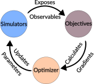

Optimization
============

``mythos`` provides a structured optimization framework for fitting
coarse-grained force field parameters to experimental observables. This page
covers the optimization lifecycle, the available optimizer and objective
classes, and how to wire observables and loss functions into objectives.

For the catalog of available observables and the ``ObservableLossFn`` wrapper,
see :doc:`observables`.

.. contents:: On this page
   :local:
   :depth: 2

.. _optimization-lifecycle:

Optimization Lifecycle
----------------------

The optimization framework is built around four abstractions:

- **Simulator**: An actor that runs a simulation and exposes one or more
  **Observables**. See :doc:`simulators` for available backends.
- **Observable**: Something produced by a ``Simulator`` — a trajectory,
  scalar, vector, or tensor. Observables are named and matched to objectives
  by convention.
- **Objective**: Takes one or more ``Observables`` and computes the
  **gradients** of a loss function with respect to the parameters being
  optimized. See :ref:`objectives` below.
- **Optimizer**: Coordinates running ``Simulators`` to produce the
  ``Observables`` needed by ``Objectives``, aggregates gradients, and applies
  parameter updates.

A single optimization step proceeds as:

1. The **Optimizer** runs the required **Simulators** (possibly in parallel).
2. Each **Simulator** produces its **Observables**.
3. The **Optimizer** passes **Observables** to the relevant **Objectives**.
4. Each **Objective** computes gradients with respect to the optimizable
   parameters.
5. The **Optimizer** aggregates gradients and applies an update rule (e.g.,
   Adam via `optax <https://optax.readthedocs.io/>`_).

.. _optimizers:

Optimizers
----------

SimpleOptimizer
^^^^^^^^^^^^^^^

``SimpleOptimizer`` pairs a single ``Simulator`` with a single ``Objective``
and a gradient transformation (e.g., ``optax.adam``). It is the right choice
when fitting parameters against one simulation and one loss function.

.. code-block:: python

    from mythos.optimization.optimization import SimpleOptimizer

    optimizer = SimpleOptimizer(
        objective=my_objective,
        simulator=my_simulator,
        optimizer=optax.adam(learning_rate=1e-4),
    )
    optimizer.run(params, n_steps=100)

See :doc:`autoapi/mythos/optimization/optimization/index` for the full API.

**Examples:**
`simple optimizations <https://github.com/mythos-bio/mythos/tree/master/examples/simple_optimizations>`_

RayOptimizer
^^^^^^^^^^^^

``RayOptimizer`` runs multiple ``Simulators`` and ``Objectives`` in parallel
using `Ray <https://ray.io>`_. This is useful when:

- You have **multiple simulations** at different conditions (e.g., multiple
  temperatures).
- You have **multiple objectives** (e.g., fit structural properties *and*
  thermodynamic properties simultaneously).
- You want to increase sample size by running multiple trajectories in parallel
  and combining in the objective.

The ``RayOptimizer`` requires a user-supplied ``aggregate_grad_fn`` to combine
gradients from multiple objectives into a single update:

.. code-block:: python

    import jax.tree_util as tree_util
    from mythos.optimization.optimization import RayOptimizer

    def mean_grads(grads_list):
        return tree_util.tree_map(
            lambda *gs: sum(gs) / len(gs), *grads_list
        )

    optimizer = RayOptimizer(
        objectives=[obj_1, obj_2],
        simulators=[sim_1, sim_2],
        optimizer=optax.adam(learning_rate=1e-4),
        aggregate_grad_fn=mean_grads,
    )
    optimizer.run(params, n_steps=100)

See :doc:`autoapi/mythos/optimization/optimization/index` for the full API.

**Examples:**
`advanced optimizations <https://github.com/mythos-bio/mythos/tree/master/examples/advanced_optimizations>`_

.. _objectives:

Objectives
----------

An ``Objective`` takes observables and computes gradients. The base
``Objective`` class accepts a ``grad_or_loss_fn`` callable that receives the
requested observables and returns ``(grads, aux)``.

.. _difftre:

DiffTRe (Differentiable Trajectory Reweighting)
^^^^^^^^^^^^^^^^^^^^^^^^^^^^^^^^^^^^^^^^^^^^^^^^

For simulators that are **not differentiable** (oxDNA, GROMACS, LAMMPS),
``mythos`` uses the `DiffTRe algorithm
<https://www.nature.com/articles/s41467-021-27241-4>`_ to estimate gradients
via Boltzmann reweighting of reference trajectories.

The ``DiffTReObjective`` extends ``Objective`` with:

- An ``energy_fn`` used to recompute energies under new parameters
- Boltzmann weight computation: :math:`w_i \propto \exp(-\beta (E_{\text{new},i} - E_{\text{ref},i}))`
- Effective sample size tracking (``n_eff``) to detect weight collapse
- Automatic reference parameter updates when ``n_eff`` drops too low

See :doc:`autoapi/mythos/optimization/objective/index` for the full API.

Defining a Loss Function for DiffTRe
"""""""""""""""""""""""""""""""""""""

.. note::

   There is an important terminology distinction here. In the optimization
   framework, **"observable"** has two meanings:

   1. **Simulator observables** — the raw outputs exposed by a ``Simulator``
      (typically a ``SimulatorTrajectory``, i.e. a sequence of rigid-body
      states). These are what the ``DiffTReObjective`` receives and passes to
      your loss function as ``ref_states`` and ``observables``.
   2. **Observable API objects** — classes like ``PropellerTwist``,
      ``BondDistances``, etc. (see :doc:`observables`) that compute physical
      quantities *from* a trajectory.

   The DiffTRe loss function operates on simulator trajectories (sense 1).
   Inside it, you can use Observable API objects (sense 2) to compute the
   physical quantities you want to optimize against.

The ``DiffTReObjective`` accepts a ``grad_or_loss_fn`` that is called with the
simulator's trajectory observables. Internally, DiffTRe uses
``jax.value_and_grad`` on a ``compute_loss`` function whose ``loss_fn``
argument has the following signature:

.. code-block:: python

    def loss_fn(
        ref_states,       # SimulatorTrajectory — the reference trajectory
        weights,          # Boltzmann reweighting weights (per frame)
        energy_fn,        # energy function with current parameters
        opt_params,       # current optimization parameters
        observables,      # list of simulator observables passed through
    ) -> tuple[float, tuple[Any, Any]]:
        """Return (loss, (measured_value, extra))."""

Here ``ref_states`` is a ``SimulatorTrajectory`` (rigid-body states from the
simulator), **not** an Observable API object. The ``observables`` list likewise
contains the raw simulator outputs matched by ``required_observables``.

The ``weights`` array contains the Boltzmann reweighting factors — these
replace the manual equilibration masking used in the simple optimization case.
Your loss function should use these weights when aggregating values across
frames.

Inside this loss function, you wire up Observable API objects to compute
physical quantities from the trajectory, then compare to experimental targets:

.. code-block:: python

    import jax.numpy as jnp
    from mythos.observables.propeller import PropellerTwist

    target_propeller_twist = jnp.array(0.6109)  # experimental target

    prop_twist_obs = PropellerTwist(
        rigid_body_transform_fn=transform_fn,
        h_bonded_base_pairs=h_bonded_pairs,
    )

    def my_loss_fn(ref_states, weights, energy_fn, opt_params, observables):
        measured = jnp.sum(prop_twist_obs(ref_states) * weights)
        loss = jnp.sqrt(jnp.mean((measured - target_propeller_twist) ** 2))
        return loss, (measured, None)

This loss function is then passed to the ``DiffTReObjective``:

.. code-block:: python

    from mythos.optimization.objective import DiffTReObjective

    objective = DiffTReObjective(
        name="propeller_twist",
        required_observables=("trajectory.oxDNASimulator.sim1",),
        energy_fn=my_energy_fn,
        grad_or_loss_fn=my_loss_fn,
        n_equilibration_steps=1000,
        min_n_eff_factor=0.95,
    )

For more complex optimizations — such as fitting to full distributions using
``WassersteinDistance``, or combining multiple observables in a single
objective — see the
`advanced optimization examples <https://github.com/mythos-bio/mythos/tree/master/examples/advanced_optimizations>`_.

For the full catalog of available observables and the ``ObservableLossFn``
convenience wrapper, see :doc:`observables`.